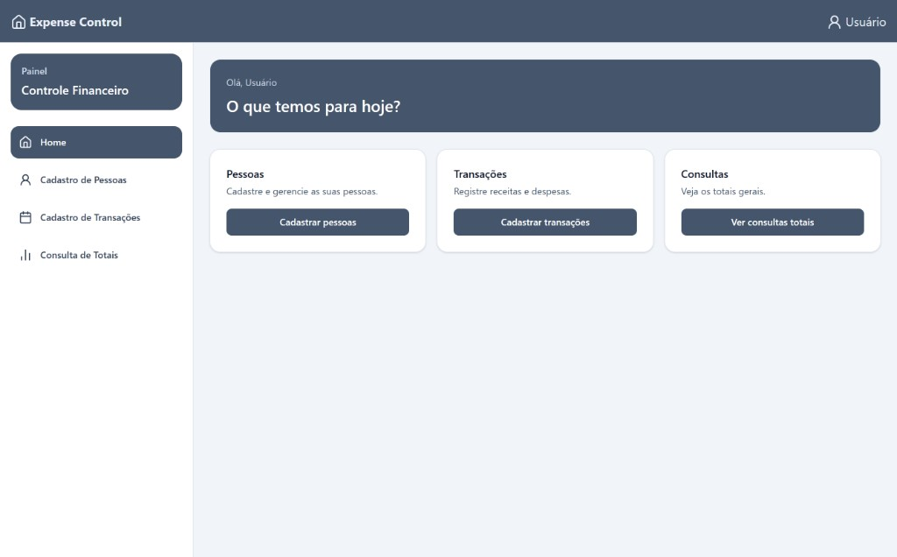
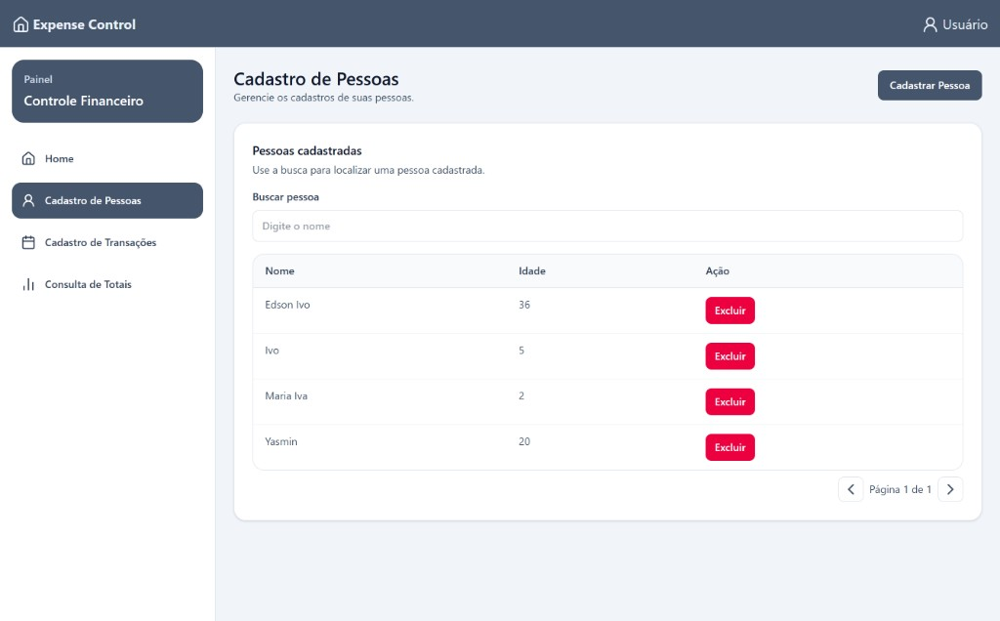
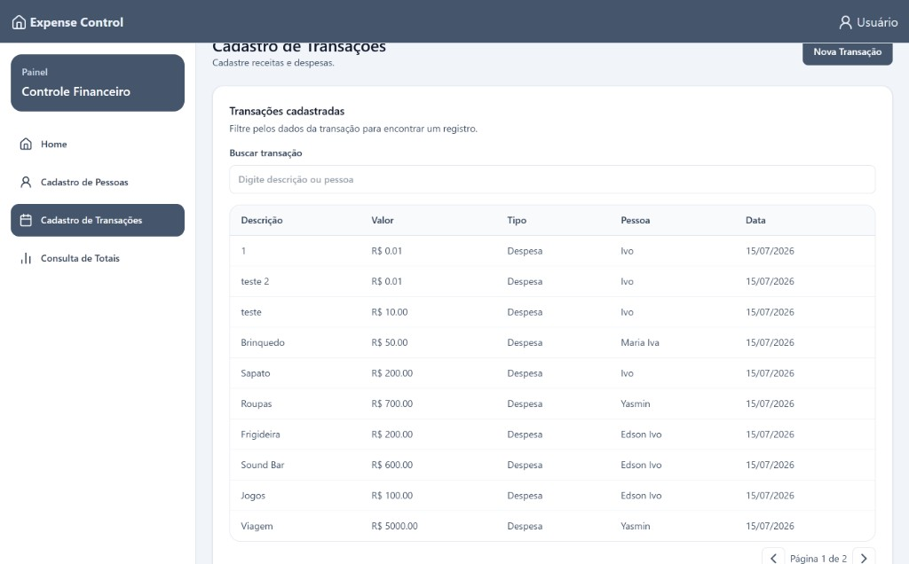
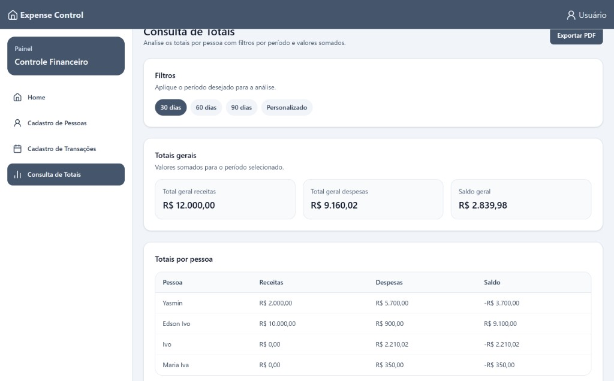

# Desafio-Tecnico

## Sobre o projeto

O **ExpenseControl** é um sistema simples desenvolvida para realizar o controle de gastos residenciais. O sistema permite o gerenciamento de pessoas, gerenciamento de transações e consulta de receitas, despesas e saldo por pessoa.

O projeto foi desenvolvido utilizando **React**, **TypeScript**, **C#**, **.NET**, **PostgreSQL**, seguindo as boas práticas recomendadas pela Microsoft para construção de aplicações CRUD.

---
# BackEnd

## Tecnologias utilizadas

- C#
- .NET
- ASP.NET Core Web API
- Entity Framework Core (EF Core)
- PostgreSQL
- Swagger (OpenAPI)

---

## Arquitetura

O projeto foi desenvolvido utilizando a arquitetura **MVC (Model-View-Controller)** adaptada para APIs REST.

A estrutura foi organizada em camadas para separar responsabilidades, facilitar a manutenção e tornar o código mais legível.

```
Controllers
    ↓
Services
    ↓
Data (Entity Framework Core)
    ↓
PostgreSQL
```

### Models

Representam as entidades da aplicação e estruturas de suporte:

| Item | Descrição |
|------|-----------|
| `User` | Pessoa cadastrada (id, nome, idade e coleção de transações) |
| `Transaction` | Movimentação financeira (descrição, valor, tipo, data de criação e vínculo com o usuário) |
| `TransactionType` | Enum com `Income` (receita) e `Expense` (despesa) |
| `PagedResult<T>` | Envelope genérico de respostas paginadas (`Datas`, `TotalRecords`, `PageNumber`, `PageSize`, `TotalPages`, `HasPreviousPage`, `HasNextPage`) |

### Controllers

São responsáveis apenas por receber as requisições HTTP, chamar os serviços e retornar as respostas da API. A regra de negócio permanece na camada de Services.

| Controller | Endpoints |
|------------|-----------|
| `UserController` | `POST /api/User` — cadastrar pessoa<br>`GET /api/User/{pageNumber}/{pageSize}` — listar pessoas paginadas<br>`DELETE /api/User/{id}` — excluir pessoa |
| `TransactionController` | `POST /api/Transaction` — cadastrar transação<br>`GET /api/Transaction/{pageNumber}/{pageSize}` — listar transações paginadas |
| `ReportController` | `GET /api/Report?startDate=&endDate=` — relatório de saldo por período |

### Services

Possui a lógica da aplicação, exposta por interfaces (`IUserService`, `ITransactionService`, `IReportService`):

- **UserService** — cadastro, listagem paginada (ordenada por nome) e exclusão de pessoas;
- **TransactionService** — cadastro com validações de negócio e listagem paginada (ordenada da mais recente para a mais antiga);
- **ReportService** — consulta de receitas, despesas e saldo por pessoa, com filtro opcional por intervalo de datas.

### Data

Contém o `AppDbContext` e as configurações das entidades utilizando **Fluent API**, responsáveis pelo mapeamento entre as entidades e o banco de dados PostgreSQL.

### DTOs

São utilizados para separar os dados enviados e recebidos pela API das entidades persistidas no banco, evitando expor diretamente os Models.

| Pasta | DTOs |
|-------|------|
| `User` | `CreateUserDto` (entrada) e `UserResponseDto` (saída) |
| `Transaction` | `CreateTransactionDto` (entrada) e `TransactionResponseDto` (saída, inclui `userName`) |
| `Report` | `UserBalanceDto` (linha por pessoa) e `ReportBalanceResponseDto` (linhas + totais gerais) |

---

# Entity Framework Core

O acesso ao banco de dados foi realizado utilizando o **Entity Framework Core**.

As tabelas e relacionamentos são criados através das **Migrations**, geradas automaticamente pelo próprio .NET.

O projeto utiliza o `AppDbContext` como camada de acesso aos dados.

Não foi implementado o padrão **Repository**, pois o próprio **Entity Framework Core** já implementa os padrões **Repository** e **Unit of Work** através do `DbContext`. Dessa forma, a implementação dessa camada não foi considerada necessária.

---

# Funcionalidades

## Cadastro de Pessoas

Permite:

- cadastrar uma pessoa;
- listar pessoas de forma **paginada** (`pageNumber` e `pageSize` na rota);
- excluir uma pessoa.

Ao excluir uma pessoa, todas as suas transações são removidas automaticamente através do relacionamento configurado com **DeleteBehavior.Cascade**.

---

## Cadastro de Transações

Permite:

- cadastrar uma transação;
- listar transações de forma **paginada** (`pageNumber` e `pageSize` na rota), da mais recente para a mais antiga.

Cada transação pertence obrigatoriamente a uma pessoa cadastrada.

---

## Paginação

As listagens de pessoas e de transações utilizam o modelo genérico `PagedResult<T>`, que padroniza a resposta com:

- itens da página atual (`Datas`);
- total de registros (`TotalRecords`);
- página atual e tamanho da página (`PageNumber`, `PageSize`);
- total de páginas e indicadores de navegação (`TotalPages`, `HasPreviousPage`, `HasNextPage`).

A paginação é aplicada no banco com `Skip` e `Take` do Entity Framework Core. No frontend, o componente de paginação consome esses metadados para navegar entre as páginas.

---

## Consulta de Totais

Consulta que retorna, para cada pessoa cadastrada:

- total de receitas;
- total de despesas;
- saldo (receitas - despesas);
- totais gerais consolidados (`totalIncome`, `totalExpense`, `totalBalance`).

Aceita filtros opcionais por `startDate` e `endDate`. Quando omitidos, o período padrão considera os últimos 30 dias até a data atual (UTC). Usuários sem movimentações no intervalo aparecem com valores zerados.

Os cálculos são realizados diretamente pelo banco de dados utilizando consultas LINQ convertidas automaticamente para SQL pelo Entity Framework Core.

---

# Regras de negócio

As seguintes regras foram implementadas:

- A pessoa informada na transação deve existir.
- Pessoas menores de 18 anos podem cadastrar apenas despesas.
- O valor da transação deve ser maior que zero.
- Ao excluir uma pessoa, todas as suas transações são removidas automaticamente.
- Na consulta de totais, a data inicial não pode ser posterior à data final.
- Todos os dados permanecem persistidos no banco PostgreSQL.

---

# Boas práticas adotadas

Durante o desenvolvimento foram seguidas recomendações da documentação oficial da Microsoft para criação de aplicações CRUD utilizando ASP.NET Core e Entity Framework Core, incluindo:

- arquitetura em camadas (MVC);
- utilização de Dependency Injection;
- uso de DTOs para entrada e saída de dados;
- Entity Framework Core para persistência;
- Fluent API para configuração das entidades;
- consultas assíncronas (`async/await`);
- utilização de `AsNoTracking()` em consultas somente leitura;
- paginação com `Skip`/`Take` e envelope `PagedResult<T>`;
- interfaces de serviço para desacoplar controllers da implementação;
- separação entre regras de negócio e acesso aos dados;
- tratamento centralizado de exceções;

---

# Referência

A implementação deste projeto foi baseada nas recomendações da documentação oficial da Microsoft para desenvolvimento de aplicações CRUD utilizando **ASP.NET Core** e **Entity Framework Core**, adaptando a arquitetura e as funcionalidades aos requisitos propostos pelo desafio técnico.

# FrontEnd

Interface web do **Expense Control**, construída com React e TypeScript para gerenciar pessoas, transações e consultar totais financeiros de forma simples e visual.

---

## Tecnologias utilizadas

- React
- TypeScript
- Vite
- Tailwind CSS
- React Router
- Axios
- jsPDF / jsPDF-AutoTable (exportação em PDF)

---

## Arquitetura

O front-end segue uma organização por **features**, separando páginas, componentes reutilizáveis e a comunicação com a API:

```
src/
├── assets/          # Ícones e estilos do tema
├── components/      # Layout (sidebar, topbar) e UI reutilizável
├── features/        # Domínios: home, usuarios, transacoes, consulta
│   ├── components/
│   ├── hooks/
│   ├── services/
│   └── utils/
├── hooks/           # Hooks compartilhados (toast, breakpoint)
├── lib/             # Cliente HTTP (Axios)
├── pages/           # Telas ligadas às rotas
├── providers/       # Tema e notificações
├── routes/          # Configuração do React Router
└── types/           # Tipagens TypeScript
```

Cada feature concentra seus próprios componentes, hooks e serviços, o que facilita manutenção e evolução das telas.

---

## Demonstração (Preview)

### Home



### Cadastro de Pessoas



### Cadastro de Transações



### Consulta de Totais



---

## Principais Funcionalidades

- **Home** — painel inicial com atalhos para pessoas, transações e consultas
- **Cadastro de Pessoas** — criar, buscar, listar com paginação e excluir pessoas
- **Cadastro de Transações** — registrar receitas e despesas, buscar por descrição ou pessoa e navegar entre páginas
- **Consulta de Totais** — visualizar receitas, despesas e saldo por pessoa e totais gerais
- **Filtros por período** — 30, 60, 90 dias ou intervalo personalizado na consulta
- **Exportação em PDF** — baixar o relatório de totais
- **Layout responsivo** — sidebar, topbar e componentes adaptados para desktop e mobile
- **Feedback ao usuário** — toasts de sucesso e erro nas operações

---

## Autor e Contato

**Yasmin Brito**

- GitHub: [Yasmin-brito](https://github.com/Yasmin-brito)
- LinkedIn: [Yasmin Brito](https://www.linkedin.com/in/yasmin-brito)